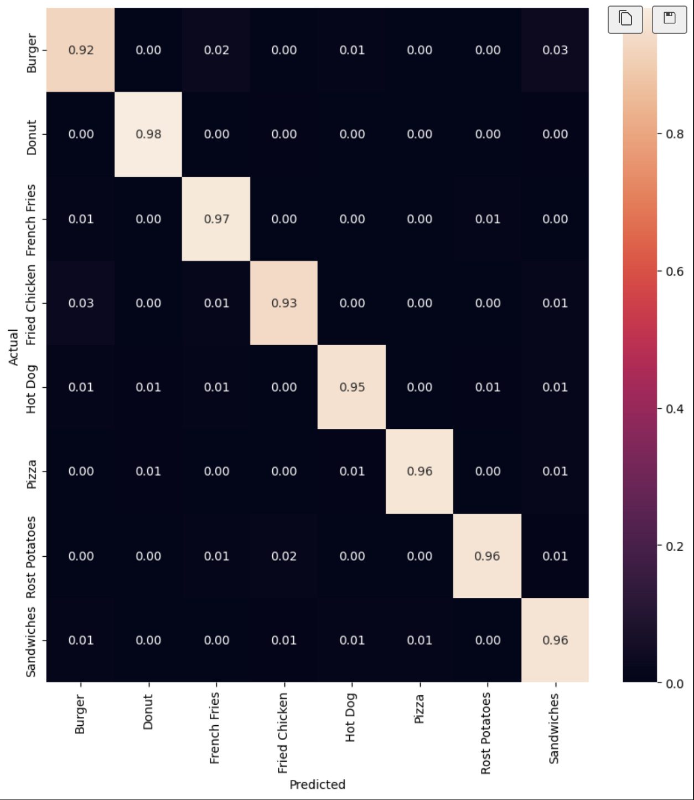

**Note**: There was a typo when defining the labels for the model. Because of this, the 'raw' predictions could be considered wrong when comparing to the test.csv labels. To temporarily fix this, the labels were 'translated' using the following dictionary:

```python
translate = {
    0:0,
    1:2,
    2:3,
    3:1,
    4:4,
    5:5,
    6:7,
    7:6
}
```

This is a temporary fix, and the model will be retrained with the correct labels.
After translating the labels, the result matches the expected results obtained in the confusion matrix.
